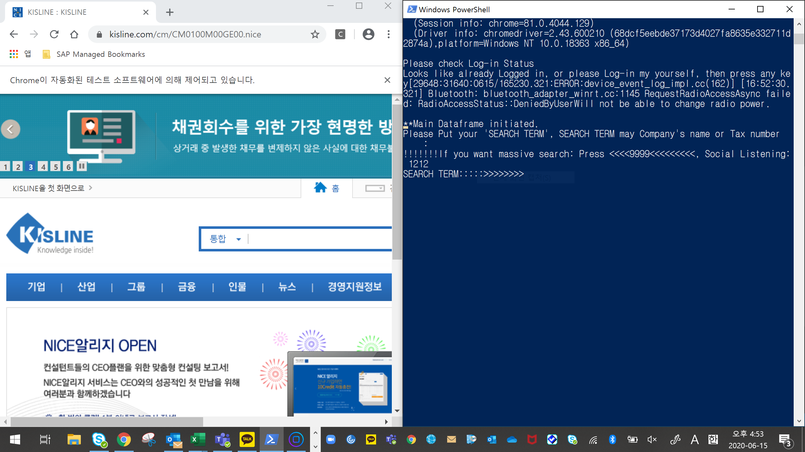
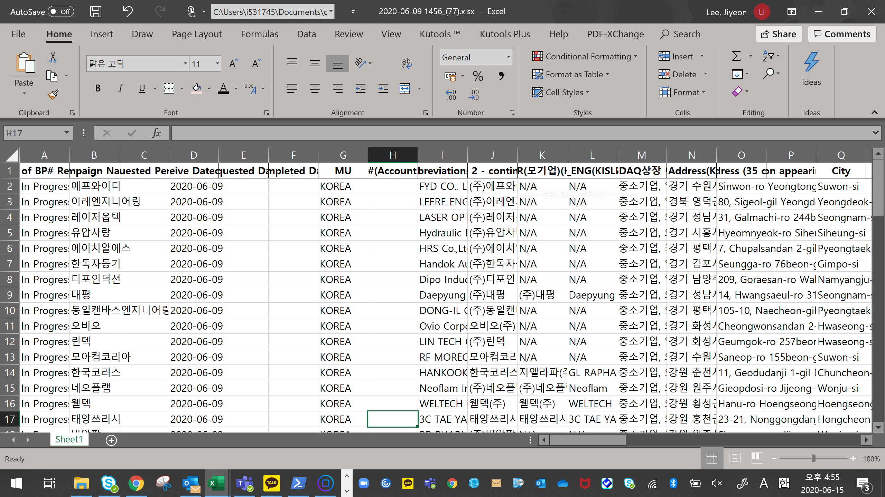

# KISLINE에서 Crawling하는 프로그램


인턴하면서 만든 KISLINE Crawling 프로그램


### Set Environment

아나콘다 설치 필요

참고 : <https://www.anaconda.com/products/individual>


### install selenium

```bash
pip install selenium
```


### Mode

1. Normal Mode

대화형으로 입력해주는 것 필요함. 


2. Massive Mode

`asset/static/massive.xlsx` 파일에서 search list들 첨부 -> 그 기준으로 massive 검색 실행.


### Run

```bash
$python copy_of_dcr.py
```

### 결과 화면

1. 실행 결과




2. 저장되는 파일 결과



